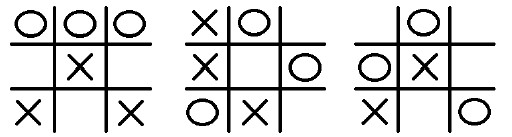
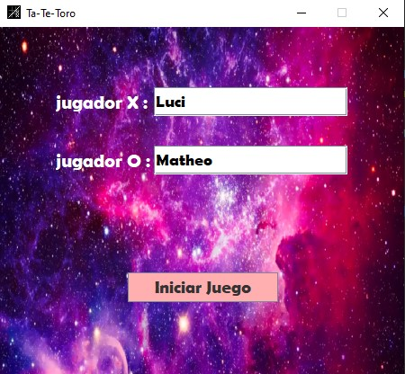
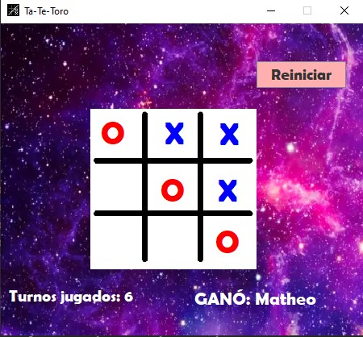

= Tatetoro 

El objetivo del trabajo práctico es implementar una aplicación para que dos usuarios jueguen
al ta-te-ti toroidal. Este juego es similar al ta-te-ti clásico sobre un tablero de 3 x 3, pero se
considera que las celdas están conectadas de manera toroidal. Es decir, un jugador gana si
ubica tres piezas propias en tres celdas seguidas (en una misma fila, columna o diagonal), y
se considera que una diagonal continua del otro lado del tablero.

Por ejemplo, las siguientes posiciones son ganadoras para el jugador que juega con los circulos:

.Menú inicial

.Ganador

